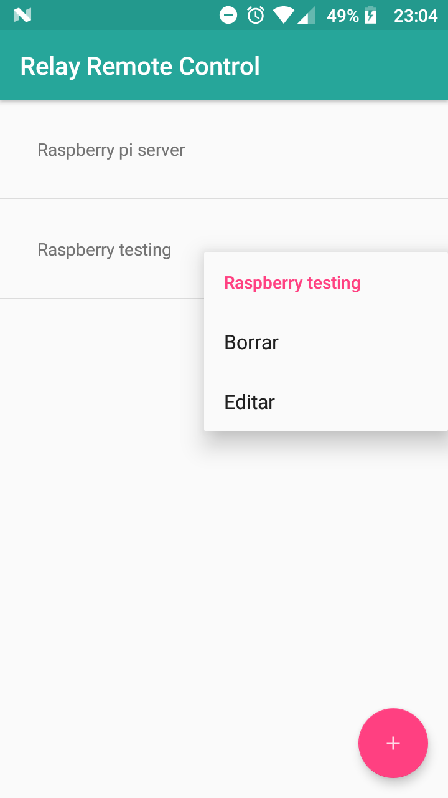
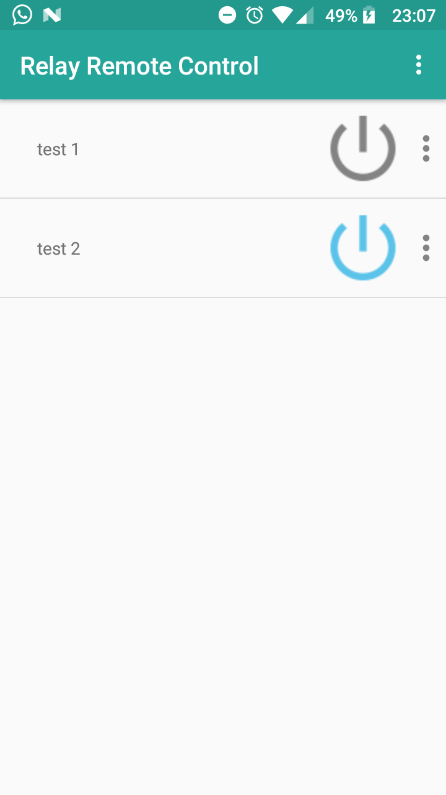
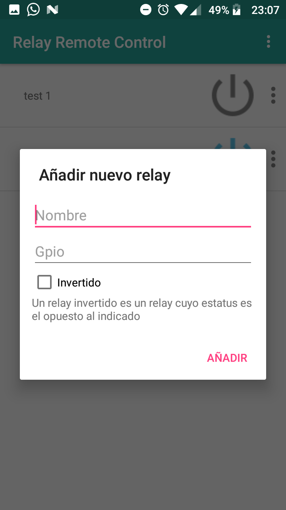
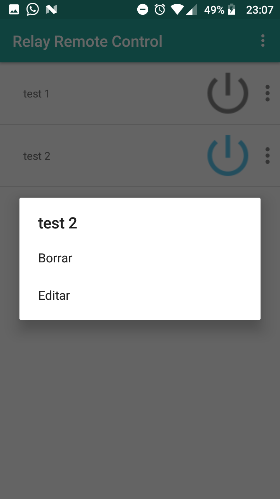

#  Relay Remote Control repository
This app for android, allow you to turn ON/OFF a relay connected to a raspberry Pi by a Gpio port.

## Required
Require the server side installed [Gpio Control Relay server](https://github.com/nearlg/gcr-server).

There is a [plugin for Kodi](https://github.com/nearlg/script.service.relay) based on gcr-server.

## Instructions
Download the apk and install it.
In the main window there is a list view of servers. You can add a new server on the _plus_ floating 
button (in the bottom|right corner).

Once a server is selected, there is a list of relays and you can add a new relay (already connected 
physically to the Raspberry Pi), just to configure the server. It is necessary to do only once.
To add a new relay, use the option menu at the top.

Also is possible to edit and delete a relay.

